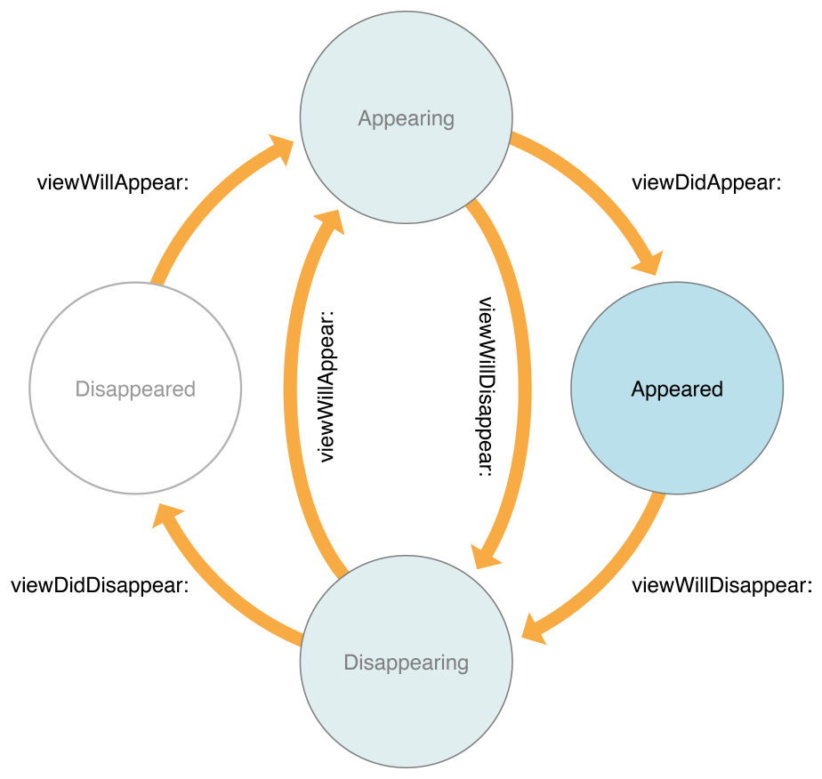

# iOS View 生命周期

>content view:
>最顶端的视图层级 / 视图树的树根

## viewDidLoad()
1. 调用时机：content view 被从 storyboard 加载并创建时调用。
2. 作用：保证 view controller 的 outlets 是有效的。
3. iOS只会调用该方法一次。
4. controller 在第一次初始化时 content view 不是必须被创建的。相反，只有系统或任何代码在获取 controller 的 view 属性时，content view 才被创建(lazily)。

## viewWillAppear()
1. 调用时机：在 content view 被添加到 app 的视图层级之前被调用。
2. 作用：触发需要在 content view 被展示到屏幕上之前需要进行的任何操作。
3. 只是在 content view 被添加到视图层级之前被调用，但并不会确保 content view 此时已经可见。

## viewDidAppear()
1. 调用时机：在 content view 被添加到 app 的视图层级之后被调用。
2. 作用：出发需要在 content view 被添加到视图层级之后需要进行的操作(e.g. 获取数据、显示动画)
3. 只是在 content view 已经添加到视图层级之后被调用，但并不会确保 content view 此时已经可见。